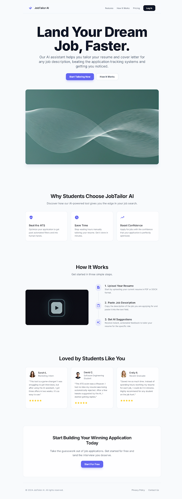
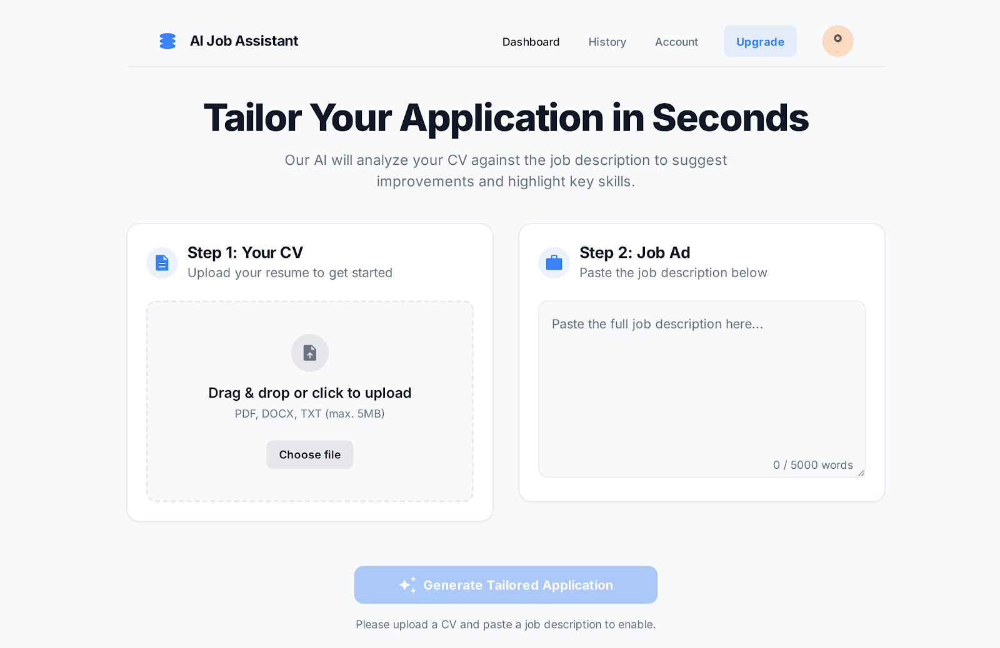
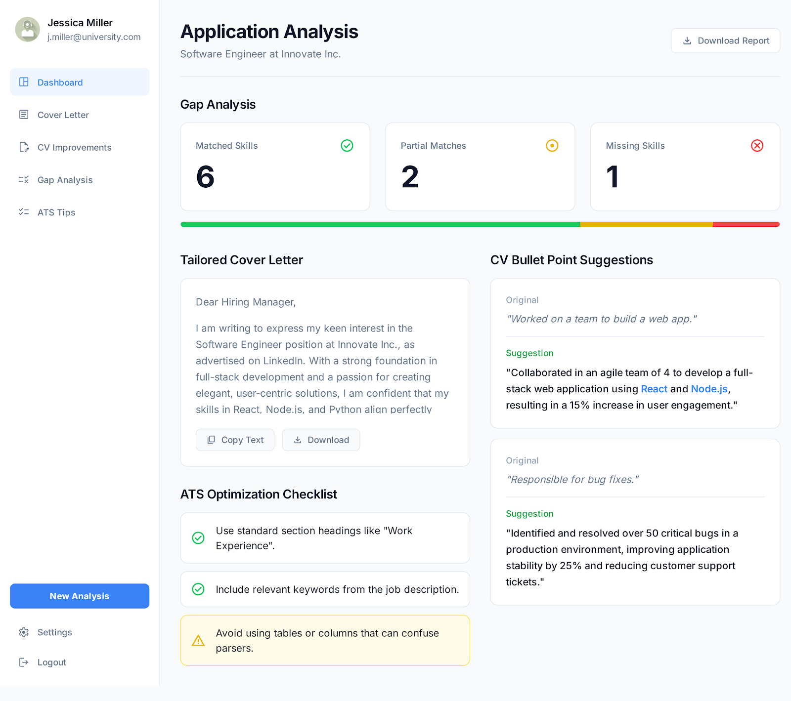

# Design Ideas Summary

This document summarizes the design ideas presented in the HTML mockups and PNG screenshots located in the `design-ideer` folder.

## 1. Welcome Screen

- **Source File:** `code_welcome.html`
- **Screenshot:** `screen_welcome.png`

This is the main landing page for the "JobTailor AI" application. Its primary goal is to attract users by highlighting the core value proposition.

### Key Features Promoted:
- **Land Your Dream Job, Faster:** A compelling headline to grab attention.
- **Beat the ATS:** Optimizes applications to pass through automated filtering systems.
- **Save Time:** Drastically reduces the time needed to tailor resumes.
- **Boost Confidence:** Helps users apply for jobs with confidence in their application quality.

### User Flow Presented:
1.  **Upload Your Resume:** User starts by providing their current resume.
2.  **Paste Job Description:** User provides the job ad they are targeting.
3.  **Get AI Suggestions:** The application provides instant feedback.

### Visuals:

---

## 2. CV and Job Ad Input Screen

- **Source File:** `codescreen_cv_and_job_ad_input.html`
- **Screenshot:** `screen_cv_and_job_ad_input.png`

This screen is the primary user interface for inputting the necessary data for analysis.

### Core Components:
- **Step 1: Your CV:** A clear drag-and-drop or file selection area for the user's CV (supports PDF, DOCX, TXT).
- **Step 2: Job Ad:** A large text area for the user to paste the job description.
- **Call to Action:** A prominent button, "Generate Tailored Application," which is disabled until both inputs are provided.

### Visuals:

---

## 3. Application Analysis Results

- **Source File:** `code_application_analyst_results.html`
- **Screenshot:** `screen_application_analyst_results.png`

This is the dashboard where the user sees the output of the AI analysis. It's designed to provide actionable insights.

### Key Sections:
- **Gap Analysis:** A visual breakdown of "Matched Skills," "Partial Matches," and "Missing Skills" to give the user a quick overview of their alignment with the role.
- **Tailored Cover Letter:** A generated cover letter, customized based on the user's CV and the job description.
- **ATS Optimization Checklist:** A list of actionable tips to improve the resume's performance with Applicant Tracking Systems.
- **CV Bullet Point Suggestions:** Concrete examples of how to improve CV bullet points, showing an original and a suggested version.

### Visuals:

---

## 4. Export Generated Content

- **Source File:** `code_export-generated_content.html`
- **Screenshot:** `screen_export-generated_content.png`

This screen allows the user to review and export the materials created by the AI.

### Features:
- **Content Review:** Tabs for reviewing the "Cover Letter," "Resume Bullets," "Skills Gap Analysis," etc.
- **Export Options:** Allows the user to download all materials in various formats:
    - Word Document (.docx)
    - PDF Document (.pdf)
    - Markdown (.md)
- **Feedback Mechanism:** Users can rate the generation with thumbs up/down.

### Visuals:

